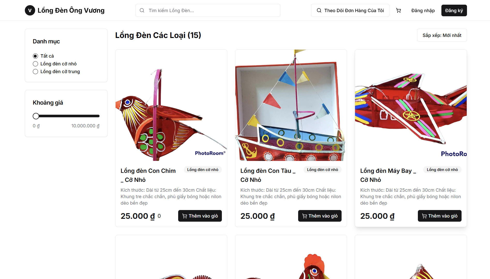

# 🏮 Lantern Store - Backend

This is the backend API server for the **Lantern Store** – an e-commerce platform for selling lanterns. Built with **NestJS** and **MongoDB Atlas**, this backend provides all the functionality needed for product management, order placement, and admin access.

---

## ✨ Technologies

- **NestJS** – A scalable server-side Node.js framework with TypeScript support
- **MongoDB Atlas** – Cloud-based NoSQL database
- **Mongoose** – Elegant MongoDB ODM for schema modeling
- **JWT** – JSON Web Token for authentication
- **bcrypt** – Password hashing for admin login
- **class-validator** – Validation for incoming data
- **Swagger (via `@nestjs/swagger`)** – Auto-generated API documentation

---

## 🚀 Features

- 🛍️ Product management: add, update, delete, and fetch products
- 📦 Order creation and tracking by phone number
- 🔐 Admin login with JWT-based authentication
- 🔎 View orders by phone number without login
- 🛡️ Secure routes for admin actions
- 🧪 Swagger UI for easy API testing

---

## 📍 The Process

The Lantern Store backend was developed to support a real-world e-commerce application where users can place orders without needing to register, using just their phone numbers. 

I chose **NestJS** for its clean architecture and scalability, and **MongoDB Atlas** as a flexible NoSQL database that supports dynamic data structures. **Mongoose** is used to define schemas and interact with the MongoDB database. 

This backend integrates seamlessly with the [Next.js frontend](https://github.com/Bean281/lantern-store-frontend) and provides a complete API solution from product listing to order fulfillment.

---

## 🎞️ Preview

